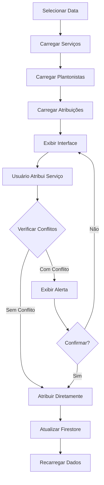

# Feature: Distribuição de Serviços

## 📋 Descrição

Funcionalidade para **todos os usuários autenticados** que permite visualizar e gerenciar a distribuição de serviços/procedimentos entre os anestesistas plantonistas do dia.

> **Nota:** Por enquanto, todos os usuários podem atribuir serviços. Futuramente, pode-se restringir a modificação apenas para coordenadores (posição = 1), mantendo a visualização para todos.

## 🎯 Funcionalidades

### 1. Visualização de Serviços

A página possui 3 abas principais:

#### 📌 Sem Atribuição
- Lista todos os serviços que ainda não têm anestesista atribuído
- Cards destacados em laranja para fácil identificação
- Permite atribuição rápida com um toque

#### 👥 Anestesistas
- Visualização em timeline de todos os plantonistas
- Mostra quantos serviços cada um tem atribuído
- Timeline visual com horários e locais
- Identificação por função (Senior, Pleno, etc.)

#### 📋 Todos os Serviços
- Lista completa de serviços do dia
- Mostra status de atribuição
- Permite reatribuição

### 2. Seleção de Data

- **Padrão:** Hoje
- Permite selecionar qualquer data
- Interface de calendário intuitiva
- Indicador visual quando está visualizando "Hoje"

### 3. Atribuição de Serviços

#### Processo:
1. Toque em um serviço
2. Selecione o anestesista da lista
3. Sistema verifica **automaticamente** conflitos de horário
4. Se houver conflito, exibe alerta detalhado:
   - Quantidade de conflitos
   - Horários conflitantes
   - Duração da sobreposição
5. Permite confirmar atribuição mesmo com conflito

#### Detecção de Conflitos:
- Calcula horário de término: `início + duração`
- Compara com todos os serviços já atribuídos ao anestesista
- Identifica sobreposições temporais
- Apresenta informações claras sobre cada conflito

### 4. Interface Otimizada para Smartphones

- **Design responsivo** com cards visuais
- **Cores distintas** por tipo de local:
  - 🔵 Centro Cirúrgico (azul)
  - 🟣 Endoscopia (roxo)
  - 🟢 Ressonância Magnética (teal)
  - 🔴 Centro de Oncologia (pink)
  - 🟡 Tomografia (índigo)
  - 🔵 Ultrassom (ciano)

- **Timeline visual** mostrando cronologia de serviços
- **Gestos intuitivos** (tap, scroll, swipe)
- **Bottom sheets** para detalhes
- **Pull-to-refresh** em todas as listas

## 🏗️ Estrutura do Código

```
features/servicos/
├── domain/
│   └── services/
│       └── distribuicao_service.dart    # Lógica de negócio
├── presentation/
│   ├── pages/
│   │   └── distribuicao_servicos_page.dart  # Página principal
│   └── widgets/
│       ├── servico_card.dart           # Card de serviço
│       └── timeline_anestesista.dart   # Timeline do anestesista
```

## 📦 Modelos de Dados

Localizados em `core/models/`:

- **Usuario** - Dados do usuário/anestesista
- **Plantao** - Escala de plantões
- **Servico** - Procedimento/Cirurgia
- **Anestesista** - Atribuição de anestesista a serviço

## 🔐 Controle de Acesso

### Versão Atual: Acesso para Todos

**Atualmente**, todos os usuários autenticados podem:
- ✅ Visualizar a distribuição de serviços
- ✅ Atribuir/remover anestesistas
- ✅ Ver detalhes de conflitos

### Regras de Segurança Firestore (Permissivas):
```javascript
match /servicos/{servicoId}/anestesistas/{anestesistaId} {
  allow read, write: if request.auth != null;
}
```

### Opção Futura: Restringir Modificações

Se quiser que apenas coordenadores possam **modificar** (mantendo visualização para todos):

```dart
// Verificar se usuário é coordenador do dia
final plantao = await buscarPlantaoDoUsuario(usuarioId, data);
final podeModificar = plantao?.posicao == 1;

// Na UI, desabilitar botões de atribuição se !podeModificar
```

Regras Firestore restritas:
```javascript
function isCoordenador() {
  return exists(/databases/$(database)/documents/plantoes/$(request.auth.uid)) 
    && get(/databases/$(database)/documents/plantoes/$(request.auth.uid)).data.posicao == 1;
}

match /servicos/{servicoId}/anestesistas/{anestesistaId} {
  allow read: if request.auth != null;  // Todos podem ver
  allow write: if request.auth != null && isCoordenador();  // Só coord pode modificar
}
```

## 🚀 Como Usar

### 1. Rota já está configurada ✅

A rota `/dashboard/distribuicao-servicos` já foi adicionada no `app_router.dart`.

### 2. Adicionar no Dashboard

**Opção A: Usar o card customizado**
```dart
import '../../../servicos/presentation/widgets/distribuicao_feature_card.dart';

// No GridView do dashboard:
const DistribuicaoFeatureCard(),
```

**Opção B: Usar FeatureCard genérico**
```dart
FeatureCard(
  title: 'Distribuição de Serviços',
  icon: Icons.assignment_ind,
  onTap: () => context.push('/dashboard/distribuicao-servicos'),
),
```

> Ver `INTEGRACAO_SIMPLES_DASHBOARD.md` para exemplo completo!

## 📊 Fluxo de Dados



## ⚠️ Validações e Regras

1. **Todos os usuários autenticados** podem acessar
2. **Verificação automática** de conflitos
3. **Auditoria** de todas as atribuições
4. **Nunca deletar** - manter histórico completo
5. **Campos de auditoria** em todas as operações:
   - `dataCriacao`
   - `criadoPor`
   - `ultimaModificacao`
   - `modificadoPor`
6. **Opção de restringir** modificações para coordenadores (ver seção Controle de Acesso)

## 🔄 Atualizações em Tempo Real

Para implementar atualizações em tempo real (opcional):

```dart
// Substituir Future por Stream no service
Stream<List<Servico>> buscarServicosPorData(DateTime data) {
  return _firestore
    .collection('servicos')
    .where('inicio', isGreaterThanOrEqualTo: Timestamp.fromDate(inicioDia))
    .where('inicio', isLessThan: Timestamp.fromDate(fimDia))
    .snapshots()
    .map((snapshot) => 
      snapshot.docs.map((doc) => Servico.fromFirestore(doc)).toList()
    );
}
```

## 📱 Screenshots de Referência

### Aba "Sem Atribuição"
- Cards laranja destacados
- Ícone de alerta
- Botão de atribuição rápida

### Aba "Anestesistas"
- Avatar com iniciais
- Contador de serviços
- Timeline com barras coloridas por local

### Aba "Todos"
- Lista completa ordenada por horário
- Indicação de status (com/sem atribuição)

### Dialog de Conflito
- Ícone de alerta laranja
- Lista de conflitos
- Botões de ação claros

## 🧪 Testes Recomendados

1. ✅ Atribuir serviço sem conflito
2. ✅ Atribuir serviço com conflito (aceitar)
3. ✅ Atribuir serviço com conflito (rejeitar)
4. ✅ Mudar de data
5. ✅ Pull-to-refresh
6. ✅ Visualizar detalhes do anestesista
7. ✅ Serviço sem duração (não pode verificar conflito)
8. ✅ Dia sem plantonistas
9. ✅ Dia sem serviços

## 📝 TODO / Melhorias Futuras

- [ ] Implementar drag & drop para atribuição
- [ ] Adicionar filtros (por local, por status)
- [ ] Exportar relatório do dia (PDF)
- [ ] Notificações push ao atribuir
- [ ] Visualização em calendário/grade horária
- [ ] Sugestão automática de distribuição (IA)
- [ ] Histórico de alterações com undo
- [ ] Modo offline com sincronização

